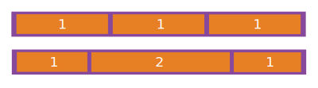

# A Complete Guide to Flexbox
```bash
# 原文：https://css-tricks.com/snippets/css/a-guide-to-flexbox/
# 三流翻译：铲宝宝
```

## 背景

Flexbox Layout 模块旨在提供一种更有效的方式来进行布局、对齐和分配 container 中 item 之间的空间，即便 item 的尺寸可能未知或是动态。

flex 布局背后的主要思想是赋予 container 改变其 items 的 width/height/order 的能力，来让 items 更好地填充可用空间（主要是适应于各种显示设备和屏幕大小）。一个 flex container 可以扩大 item 来占据可用空间或缩小 item 来避免 overflow 。

最重要的是，flex 布局与方向无关，这和常规布局不同（block 基于垂直方向，inline 基于水平方向）。虽然常规布局十分有用，但它们在支持大型或复杂应用程序中，缺乏灵活性。尤其在方向改变，大小调整，拉伸，缩小等场景下。

注意：flex 布局最适用于应用程序的组件和小型布局，而 grid 布局适用于更大型的布局。

## 基础知识及术语

flexbox 是一个完整的模块，而非一个属性，因此它涉及很多内容，其中包括一系列相关属性。部分属性是作用在 container 上("flex container")，而部分是在 item 上("flex items")。


item 通常按照 main axis 主轴 (from main-start to main-end) 或 cross axis 交叉轴 (from cross-start to cross-end) 方向进行布局。

- main axis
  flex container 的 main axis 决定了 items 的布局方向。它不一定是水平的，它取决于 flex-direction 属性的值。
- main-start | main-end
  flex item 被放置在 flex container 内，从 main-start 到 main-end 的方向放置。
- main size
  main size 是 flex item 的 width 或 height 的值（以当前 main axis 的方向决定）。
- cross axis
  垂直于 main aixs 的轴称为 cross axis。它的方向取决于 main axis 的方向。
- cross-start | cross-end
  同理 main-start | main-end
- cross size
  同理 main size

### 作用于 flex container 的属性


#### display

以下代码定义一个 flex container 。它为其所有直系子元素 item 提供了一个 flex context 。

```css
.container {
  display: flex;
}
```

#### flex-direction

这个属性决定了 main axis ，也就决定了 flex item 在 flex container 中的排列方向。

```css
.container {
  flex-direction: row | row-reverse | column | column-reverse;
}
```


#### flex-wrap

默认情况下，flex item 会尝试排列在一行中(nowrap)。你可以根据实际需求，利用这个属性，改变它的排列规则。

```css
.container {
  flex-wrap: nowrap | wrap | wrap-reverse;
}
```


#### justify-content

该属性帮助分配了沿 main axis 方向上 flex item 之间的 free space。

```css
.container {
  justify-content: flex-start | flex-end | center | space-between | space-around | space-evenly;
}
```


#### align-items

该属性定义了沿 cross axis 方向上 flex item 的布局行为。可以把这个属性看作是 cross axis 方向上的 justify-content 属性。

```css
.container {
  align-items: flex-start | flex-end | center | baseline | stretch;
}
```


#### align-content

该属性定义了 flex container 的 lines 在 cross-axis 方向上存在 free space 时的对齐方式。 justify-content 和 align-items 是作用于 item ， align-content 作用于 line 。如果当前只有一行 flex item，则该属性不起作用。

```css
.container {
  align-content: flex-start | flex-end | center | space-between | space-around | stretch;
}
```


#### flex-flow

```css
flex-flow: <'flex-direction'> || <'flex-wrap'>
```

### 作用于 flex item 的属性


#### order

默认情况下， flex item 按源码书写顺序排列。order 属性可以控制 flex item 在 flex container 中的排列顺序。

```css
.item {
  order: <integer>; /* default is 0 */
}
```


#### flex-grow

该属性定义了 flex item 在必要时增长的能力。其属性值定义了 flex item 在 flex container 中的空间占用比例。如果flex container 中所有 flex item 的 flex-grow 设置为1，则 container 中的 free space 将平均分配给所有 item。 如果其中一个 item 的值为2，则该 item 分配到的 free space 大小将是其他 item 的两倍（或至少会尝试）。相反的属性  flex-shrink 定义了 flex item 在必要时压缩的能力 

```css
.item {
  flex-grow: <number>; /* default 0 */
  flex-shrink: <number>; /* default 1 */
}
```



#### align-self

该属性允许为指定的 flex item 覆盖重写对齐方式（或由align-items指定的对齐方式）。即 align-items 和 align-self 功能一样，但 align-items 作用于 flex container 上，影响其所有直系 flex item ，而 align-self 作用于 flex item 上。Note: `float`, `clear` `vertical-align` 对 flex item 不起作用。

```css
.item {
  align-self: auto | flex-start | flex-end | center | baseline | stretch;
}
```

#### flex

flex-grow, flex-shrink and flex-basis 的简写属性。flex-shrink and flex-basis 非必填。默认值 0 1 auto。

```css
.item {
  flex: none | [ <'flex-grow'> <'flex-shrink'>? || <'flex-basis'> ]
}
```
