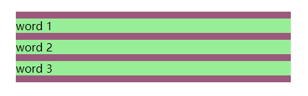

# 关于Css中的BFC

__BFC(Block Formatting Context)__ 是 __Web__ 页面中盒模型布局的 __CSS__ 渲染模式。它的定位体系属于常规文档流。__[W3C](http://www.w3cplus.com/css/understanding-block-formatting-contexts-in-css.html©w3cplus.com)__ 对其描述为一个 __块级格式化上下文__。

一个 __BFC__ 是一个 __HTML__ 盒子并且至少满足下列条件中的任何一个：

```bash
1.float的值不为none

2.position的值不为static或者relative

3.display的值为 table、table-cell、table-caption、inline-block、flex、inline-flex

4.overflow的值不为visible
```

### 使用BFC来防止外边距折叠

我们先来看下外边距折叠的情况

```html
<div class="container">
    <p>word 1</p>
    <p>word 2</p>
    <p>word 3</p>
</div>
```

```css
.container {
    width: 400px;
    margin: 400px auto;
    background-color: #9e5a7e;
    overflow: hidden;  /* creates a block formatting context */
}

p {
    background-color: lightgreen;
    margin: 10px 0;
}
```
效果如下图所示：



可以看到上下 __p__ 元素的 __10px__ 外边距 __（margin）__ 并不是 __20px__ 。叠加状态下，将会以较大的外边距 __（margin）__ 显示。即同一个 __BFC__ 下毗邻块级盒子的垂直外边距会发生折叠。

若他们不属于同一个BFC，他们之间的外边距将不会折叠，代码如下

```html
<div class="container">
    <p>word 1</p>
    <p>word 2</p>
    <div class="newBFC">
    	<p>word 3</p>
    </div>
</div>
```

```css
.container {
    width: 400px;
    margin: 400px auto;
    background-color: #9e5a7e;
    overflow: hidden;  /* creates a block formatting context */
}

p {
    margin: 10px 0;
    background-color: lightgreen;
}

.newBFC {
    overflow: hidden;  /* creates a block formatting context */
}
```
效果如下图所示：


### 使用BFC解决包含浮动元素的父级没有高度

正常情况下一个不是BFC的容器中只包含浮动元素时，容器没有高度。

```html
<div class="container">
    <div class="box"></div>
</div>
```

```css
.container {
    width: 400px;
    margin: 400px auto;
    background-color: #9e5a7e;
}

.box {
    width: 100px;
    height: 50px;
    float: left;
    background-color: lightgreen;
}
```

效果如下图所示：


此时我们可以在容器内再添加一个div清除浮动来解决，或者可以创建BFC来解决

```html
<div class="container">
    <div class="box"></div>
</div>
```

```css
.container {
    width: 400px;
    margin: 400px auto;
    background-color: #9e5a7e;
    overflow: hidden;  /* creates a block formatting context */
}

.box {
    width: 100px;
    height: 50px;
    float: left;
    background-color: lightgreen;
}
```

效果如下图所示：


### 使用BFC防止文字环绕

有时候一个浮动 __div__ 周围的文字环绕着它（如下图中的左图所示）但是在某些案例中这并不是可取的，我们想要的是外观跟下图中的右图一样的。为了解决这个问题，我们可能使用外边距，但是我们也可以使用一个 __BFC__ 来解决。


首先让我们理解文字为什么会环绕。


图中的HTML可以假定为这样：

```html
<div class="container">
    <div class="floated">Floated div</div>
    <p>Quae hic ut ab perferendis sit quod...</p>
</div>
```

在上图中的整个黑色区域为 __p__ 元素。正如我们所看到的，这个 __p__ 元素并没有移动，但是它却出现在浮动元素的下方。__p__ 元素的 __line boxes__ （指的是文本行）进行了移位。此处 __line boxes__ 的水平收缩为浮动元素提供了空间。    
    
随着文字的增加，因为 __line boxes__ 不再需要移位,最终将会环绕在浮动元素的下方，因此出现了那样的情况。这就解释了为什么即使在浮动元素存在时，段落也将紧贴在包含块的左边框上，还有为什么 __line boxes__ 会缩小以容纳浮动元素。
    

根据这些，如果这个 __p__ 元素创建了一个新的BFC,那么它将不会紧挨着容器块的左边缘。这个可以通过简单的给 __p__ 元素添加 __overflow: hidden__ 来实现。这个方法创建了一个新的 __BFC__ 解决了文字环绕在浮动元素周围的问题。

### 多列布局使用BFC

如果我们正在创建的一个多列布局占满了整个容器的宽度，在某些浏览器中最后一列有时候将会被挤到下一行。以三列布局为例：

```html
<div class="container">
    <div class="column">column 1</div>
    <div class="column">column 2</div>
    <div class="column">column 3</div>
</div>
```

```css
.column {
    width: 31.33%;
    background-color: green;
    float: left;
    margin: 0 1%;
}

.column:last-child {
    float: none;
    overflow: hidden;
}
```
效果如下图所示：


PS：建议使用flex布局更快

本文大多参考至 [http://www.w3cplus.com/css/understanding-block-formatting-contexts-in-css.html](http://www.w3cplus.com/css/understanding-block-formatting-contexts-in-css.html)